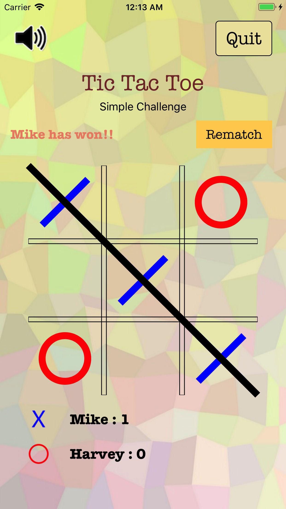

# Tic-Tac-Toe

Tic Tac Toe - Simple challenge is a 2-player or Single player classic board game. It has amazing music and sound effects that makes it even more enjoyable. Its an ad-free game which can be played offline.

It has amazing features:

Players: 2 or 1
Skill(s) required: Strategy, Tactics, Observation
Soothing Background Music 

Play it with your friend or the computer, and beat them as many times as you want!!
This field is required. 3591 Keywords Include one or more keywords that describe your app. Keywords make App Store search results more accurate. Separate keywords with an English comma, Chinese comma, or a mix of both.
tic tac toe, tic tac toe 2 player, single player, free games, tic tac toe - free, board game, tictactoe

# Screenshots

 

 

 

 

 

 

# Requirements

- Xcode 9
- iOS 11
